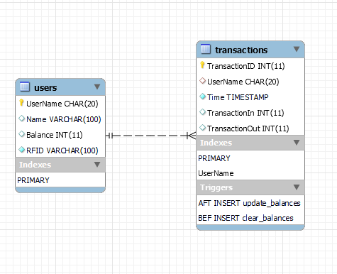

# Smartby
Smartbyprosjekt for studassstilling

## Node-RED avhengigheter

Disse må installeres for å få kjørt Node-RED flowene:

* Worldmap
* Dashboard

## Database
### ER-diagram

### Databasen (smartby.sql) kan importeres inn i MariaDB.

